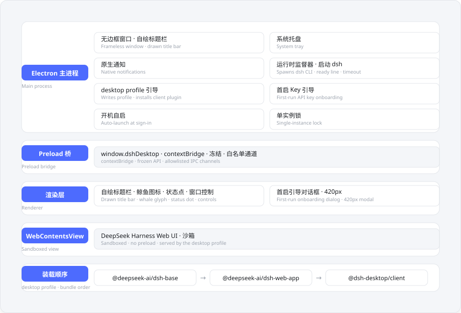

# dsh-desktop

[🇨🇳 中文](#中文) · [🇬🇧 English](#english)

  

> 一键原生桌面客户端，双击就能用上 DeepSeek Harness。不用装 Node，不用敲命令，安装完成，打开就是一个窗口。

> 无边框窗口 · 系统托盘 · 原生通知 · 单实例运行。DeepSeek Harness 的全部能力，零搭建成本。

  
  
  
  
  
  
  

<!-- Badge notes: version badge is live (github/v/release, resolves to the latest published release). Stars, forks and CI are live shields.io links and update on their own. Platform and DeepSeek Harness compatibility are static. -->

---

## 中文

> 📖 完整文档站（中英即时切换）→ https://github.com/SnowCrescenter-tech/dsh-desktop/tree/main/website

### 项目简介

DeepSeek Harness 是 DeepSeek 官方的 agent 框架。官方目前还是开发者预览版，自己动手装的话，得先装 Node 22.19+ 或 Node 24、装好 pnpm，再对着命令行敲一串命令。对大多数非技术用户来说，这道门槛实在太高了。

dsh-desktop 把 DeepSeek Harness 的 Web UI 包进一个原生 Windows 桌面程序。界面本身完全不动，只是外面多了一层顺手的壳：程序常驻系统托盘，窗口用自绘标题栏，消息走 Windows 原生通知，同一时间只跑一个实例。下载、安装、双击，完事。

### 功能一览

| 功能 | 一句话说明 |
|---|---|
| 无边框窗口 | 自绘 36px 标题栏 + 实时状态点 |
| 系统托盘 | 常驻后台，单击唤回，右键菜单齐全 |
| 原生通知 | 标准 Windows 通知样式，原生缺失时降级为托盘气泡 |
| 单实例运行 | 同时只跑一个，重复双击唤出已有窗口 |
| 开机自启 | 可选，登录后在后台静默启动 |
| 首次引导 | 首启粘贴 API Key，即贴即用，Key 只存本机 |
| 端口 0 自动分配 | 每次启动自动挑空闲端口，永不冲突 |
| 自动更新 | 后台静默下载，重启即完成更新 |

### 功能特性

- `▭` **无边框窗口**：没有系统默认边框，36px 标题栏由程序自绘，并带一个实时状态点。青色 = 本地服务运行中，灰色 = 启动中，红色 = 出错了。Windows 11 下窗口圆角由 DWM 原生渲染。
- `▣` **系统托盘**：程序常驻托盘。单击图标唤回主窗口；右键菜单包含：打开主界面、开机自启（复选）、关于、退出。
- `◈` **原生通知**：提醒走 Windows 原生通知样式，和普通应用一模一样；系统不支持时自动降级为托盘气泡。
- `◎` **单实例运行**：同一时间只允许一个实例，重复双击只会把已有窗口唤到前台。
- `↻` **开机自启**：可选，登录后在后台自动启动，由 Windows 注册表 Run 键实现。
- `▤` **首次启动引导**：第一次运行弹出一个向导对话框，引导你输入 DeepSeek API Key。Key 只保存在这台电脑上，位置是 `<DSH_HOME>/.env`。
- `⇄` **端口 0 自动分配**：每次启动都让系统挑一个空闲端口（`--port 0`），天然不会和 3080 或其他程序撞车。
- `↑` **自动更新**：安装版（NSIS）启动后会在后台静默检查新版本并自动下载；下载就绪后弹原生通知，托盘菜单出现"重启并更新"，点击即重启应用完成安装。便携版没有安装器，"检查更新"会打开 GitHub Releases 页面，由你自行下载新版 zip 替换旧目录。

### 快速开始

1. 到 Releases 页面下载最新安装包。
2. 安装完成，双击桌面上的 DeepSeek Harness 图标。
3. 首次启动时，在引导对话框里粘贴你的 DeepSeek API Key，主窗口会自动打开。

程序会自动启动服务、打开主界面，这些都不需要你手动操作。

### 首次运行流程

首次启动是一条编排好的流水线。如果没有配置 API Key，先弹模态对话框引导输入；然后写盘 desktop profile，以 `--profile desktop --port 0` 拉起捆绑的 CLI，监督器等待就绪行（`dsh web: http://127.0.0.1:<port>`）。一旦解析到，就把 Web UI 载入内容区，状态点变青。

1. 获取单实例锁。若已有实例在运行，本进程直接退出，由已有实例唤出主窗口。
2. 若尚未配置 API Key，先弹出引导对话框，输入并保存到 `<DSH_HOME>/.env`。
3. 写盘 `desktop` profile，再以 `dsh --profile desktop --port 0` 拉起捆绑的 CLI。
4. 等待就绪行（`dsh web: http://127.0.0.1:<port>`）。解析到后，Web UI 载入内容区，状态点变青；若超时，则显示带重试按钮的错误视图。

### 首次启动：设置 API Key

第一次运行会先弹出引导窗口，让你填写 DeepSeek API Key：

1. 打开 https://platform.deepseek.com，注册并登录。
2. 在 API Keys 页面点击"创建"，会得到一个形如 `sk-...` 的 Key。
3. 把 Key 粘贴进引导窗口，点击保存，主界面就会自动打开。

你的 Key 只会写在自己电脑上，不会上传到任何地方。

### 架构一览

dsh-desktop 是一个 Electron 外壳。主进程负责窗口、托盘、通知、开机自启，以及启动并守护捆绑的 DeepSeek Harness CLI 的运行时监督器；preload 桥把一份精简且冻结的 `window.dshDesktop` API 暴露给渲染层；窗口自身的 web 内容绘制标题栏，其下方一个沙箱化的 WebContentsView 承载 DeepSeek Harness 的 Web UI；这套 Web UI 跑在 `desktop` profile 上，按序装载 `@deepseek-ai/dsh-base`、`@deepseek-ai/dsh-web-app` 和 `@dsh-desktop/client`。

### 常见问题

**杀毒软件报毒、SmartScreen 提示怎么办？**

桌面应用打包后没有数字签名，第一次运行时 Windows SmartScreen 可能会提示"Windows 已保护你的电脑"，部分杀毒软件也可能误报。这是打包软件的常见情况，不代表程序有问题。

- SmartScreen 提示：点击"更多信息" → "仍要运行"
- Windows Defender：病毒和威胁防护 → 排除项 → 添加排除项
- 360 安全卫士：木马查杀 → 信任区 → 添加信任目录
- 火绒安全：防护中心 → 病毒防护 → 信任区 → 添加文件/目录
- 腾讯电脑管家：病毒查杀 → 信任区

**能安装在中文路径吗？**

可以。桌面版不依赖命令行脚本，装在带中文的路径（比如"软件\DeepSeek Harness"）下也能正常运行。

**端口被占用怎么办？**

服务监听端口由系统自动分配（端口 0），启动时系统会挑一个空闲端口，天然不会和 3080 或其他程序冲突，也不需要手动配置。

**关掉窗口后程序为什么还在？**

关闭窗口默认是最小化到托盘，程序仍在后台运行。从托盘菜单里选"退出"才会完全结束。

**怎么更新到新版本？**

安装版启动后会在后台自动检查更新。新版本就绪时会有通知提醒，从托盘菜单选"重启并更新"（或直接重启应用），退出时即完成安装；任何时候都可以用托盘菜单的"检查更新"手动检查。便携版没有自安装器："检查更新"会打开 GitHub Releases 页面，下载最新的 zip 解压替换旧目录即可。

**README 怎么做到中英即时切换？**

本 README 是单文件双语排版：顶部 `🇨🇳 中文` 与 `🇬🇧 English` 两个标签直接跳转到对应章节，整个过程不翻页、不换文件。想要真正的交互式体验（语言即时切换、深色模式、站内搜索）时，请访问在线文档站：https://github.com/SnowCrescenter-tech/dsh-desktop/tree/main/website

**需要付费吗？**

软件本身是免费开源项目，但调用 DeepSeek 的 API 由官方按量计费。当前参考价（每百万 tokens）：deepseek-v4-flash 输入 $0.14、输出 $0.28；deepseek-v4-pro 输入 $0.435、输出 $0.87；命中缓存时输入价格要低得多。具体价格以 https://api-docs.deepseek.com/quick_start/pricing 为准，2026-08-16 起官方改为峰谷计价。

### 技术说明

- 基于 Electron 43 构建，内置 Node 运行时 v24.19.0。
- 通过 `@deepseek-ai/dsh@0.1.0-rc.6` 启动 Web UI。
- 数据与 API Key 保存在 `%USERPROFILE%\.dsh`（可用 `DSH_HOME` 环境变量覆盖）。
- desktop profile 按序装载：`@deepseek-ai/dsh-base` → `@deepseek-ai/dsh-web-app` → `@dsh-desktop/client`。
- 标题栏、托盘与引导遵循一套简约沉静的设计语言，配色取自 DeepSeek 品牌蓝（强调色 `#4D6BFE`、深墨 `#10131A`、纸白 `#F4F6F9`）。

### 免责声明

本项目是社区作品，非 DeepSeek 官方出品。DeepSeek Harness 目前处于 developer preview 阶段，后续可能有破坏性变更。本项目基于 MIT 协议开源，使用中遇到的问题请优先查阅官方文档。

### 相关链接

- DeepSeek Harness 官方仓库：https://github.com/deepseek-ai/deepseek-harness
- API 控制台：https://platform.deepseek.com
- 项目 Topics：dsh-plugin、dsh、deepseek-harness、windows、electron、desktop

---

## English

> 📖 Full docs site (instant zh/en switching) → https://github.com/SnowCrescenter-tech/dsh-desktop/tree/main/website

### What is this?

DeepSeek Harness is DeepSeek's official agent framework. The official build is still a developer preview: setting it up by hand means installing Node 22.19+ or Node 24, pnpm, and a stack of command line steps. That is a high bar for most people.

dsh-desktop wraps the DeepSeek Harness Web UI in a native Windows desktop app. The interface itself is untouched, it just gets a friendlier shell: the app lives in the system tray, the window has its own drawn title bar, notifications use the standard Windows style, and only one instance can run at a time. Download, install, double-click, done.

### At a glance

| Feature | What it does |
|---|---|
| Frameless window | Drawn 36px title bar with a live status dot |
| System tray | Stays in the tray; one click brings it back |
| Native notifications | Standard Windows notification style, tray-balloon fallback |
| Single instance | One copy at a time; a second launch brings it forward |
| Start on boot | Optional background launch after sign-in |
| First-run onboarding | Paste your API key once; it stays on your machine |
| Port 0 auto-assign | Windows picks a free port on every launch |
| Auto-update | Downloads in the background; restart to apply |

### Features

- `▭` **Frameless window**: no system frame. The 36px title bar is drawn by the app and carries a live status dot: teal while the local service runs, grey while it starts, red when something fails. On Windows 11 the corners come from DWM, natively.
- `▣` **System tray**: the app stays in the tray. Single-click brings the window back; right-click opens the menu: open main window, start on boot (checkbox), about, exit.
- `◈` **Native notifications**: alerts use the standard Windows notification style, like any normal app, with a tray-balloon fallback where native support is missing.
- `◎` **Single instance**: one copy at a time. A second double-click just brings the existing window to the front.
- `↻` **Start on boot**: optionally launch in the background after sign-in, backed by a Windows registry Run key.
- `▤` **First-run onboarding**: the first launch shows a guided dialog that asks for your DeepSeek API key. The key is saved only on this machine, in `<DSH_HOME>/.env`.
- `⇄` **Port 0 auto-assign**: the service asks Windows for a free port on every launch (`--port 0`), so it never collides with port 3080 or any other program.
- `↑` **Auto-update**: the installed (NSIS) build silently checks for a new version shortly after launch and downloads it in the background. When it is ready, a native notification appears and the tray menu shows "Restart and update"; pick it to restart and apply. The portable zip has no installer, so its "Check for updates" opens the GitHub Releases page instead.

### Quick start

1. Grab the latest installer from the Releases page.
2. Install, then double-click the DeepSeek Harness icon on your desktop.
3. On first launch, paste your DeepSeek API key into the setup dialog. The main window opens on its own.

The app starts the service and opens the main window for you. No manual steps.

### First run: what happens under the hood

The first launch is an orchestrated sequence. If no API key is configured, a modal dialog asks for one. The profile is written to disk, the bundled CLI is spawned with `--profile desktop --port 0`, and the supervisor waits for the ready line (`dsh web: http://127.0.0.1:<port>`). Once parsed, the Web UI is loaded into the content view and the status dot turns teal.

1. Acquire the single-instance lock. A second launch just brings the existing window to the front.
2. If no API key is configured yet, the onboarding dialog asks for one and saves it to `<DSH_HOME>/.env`.
3. Write the `desktop` profile to disk, then spawn the bundled CLI: `dsh --profile desktop --port 0`.
4. Wait for the ready line (`dsh web: http://127.0.0.1:<port>`). Once parsed, the Web UI loads into the content view and the status dot turns teal. If it times out, an error view with a retry button is shown.

### First launch: setting your API key

The first run shows a setup dialog where you enter your DeepSeek API key:

1. Go to https://platform.deepseek.com and sign in.
2. On the API Keys page click "Create" to get a key that looks like `sk-...`.
3. Paste the key into the dialog, click save, and the main window opens.

Your key is stored only on your own machine. It is never uploaded anywhere.

### How it works

dsh-desktop is an Electron shell. The main process owns the window, tray, notifications, auto-launch and the runtime supervisor that starts and watches the bundled DeepSeek Harness CLI. A preload bridge exposes a small, frozen `window.dshDesktop` API to the renderer. The window's own web contents draw the title bar, and a sandboxed `WebContentsView` below it hosts the DeepSeek Harness Web UI, which runs on the `desktop` profile: `@deepseek-ai/dsh-base`, `@deepseek-ai/dsh-web-app`, and `@dsh-desktop/client`.

### FAQ

**Antivirus warning or SmartScreen prompt?**

Packaged desktop apps have no code signature. The first run may trigger the Windows SmartScreen "Windows protected your PC" message, and some antivirus tools may raise a false positive. This is normal for packaged software, not a sign of a problem.

- SmartScreen: click "More info" then "Run anyway"
- Windows Defender: Virus & threat protection → Exclusions → Add an exclusion
- 360 安全卫士: 木马查杀 → 信任区 → 添加信任目录
- 火绒安全: 防护中心 → 病毒防护 → 信任区 → 添加文件/目录
- 腾讯电脑管家: 病毒查杀 → 信任区

**Can I install it in a path with Chinese characters?**

Yes. The desktop app does not rely on command line scripts, so it works fine under paths with Chinese characters (for example `软件\DeepSeek Harness`).

**Port already in use?**

The service listens on a system-assigned port (port 0), so Windows picks a free one at startup. It never conflicts with port 3080 or any other program, and no manual configuration is needed.

**Why is the app still running after I close the window?**

Closing the window minimizes to the tray by default, and the app keeps running in the background. Pick "Exit" from the tray menu to fully quit.

**How do I update to a new version?**

The installed version checks for updates automatically in the background after launch. When a new version is ready, a notification appears. Choose "Restart and update" from the tray menu (or just restart the app) and the update applies on quit. You can also use the "Check for updates" tray menu item at any time. The portable zip has no self-installer: "Check for updates" opens the GitHub Releases page, where you download the latest zip and replace the old folder.

**How do I switch between Chinese and English instantly?**

This README is a single-file bilingual document. The `🇨🇳 中文` and `🇬🇧 English` tabs at the top jump straight to the section you want, with no page reload and no separate files. For a full interactive experience (instant locale switching, dark mode, search), use the docs site: https://github.com/SnowCrescenter-tech/dsh-desktop/tree/main/website

**Do I have to pay?**

The software is free and open source, but the DeepSeek API is pay-as-you-go. Current reference prices (per million tokens): deepseek-v4-flash $0.14 input / $0.28 output; deepseek-v4-pro $0.435 input / $0.87 output; cache-hit input is far cheaper. See https://api-docs.deepseek.com/quick_start/pricing for the authoritative list. Billing switches to peak/off-peak pricing starting 2026-08-16.

### Technical notes

- Built with Electron 43 and a bundled Node runtime (v24.19.0).
- Runs the Web UI through `@deepseek-ai/dsh@0.1.0-rc.6`.
- Data and your API key live under `%USERPROFILE%\.dsh` (override with the `DSH_HOME` environment variable).
- The `desktop` profile mounts, in order: `@deepseek-ai/dsh-base` → `@deepseek-ai/dsh-web-app` → `@dsh-desktop/client`.
- The title bar, tray and onboarding follow a minimal, calm design language built on the DeepSeek brand palette (accent `#4D6BFE`, dark ink `#10131A`, paper `#F4F6F9`).

### Disclaimer

Community project, not an official DeepSeek product. DeepSeek Harness is in developer preview and may change without notice. This project is MIT licensed. Check the official docs first when you hit problems.

### Links

- Official repo: https://github.com/deepseek-ai/deepseek-harness
- API console: https://platform.deepseek.com
- Topics: dsh-plugin, dsh, deepseek-harness, windows, electron, desktop
